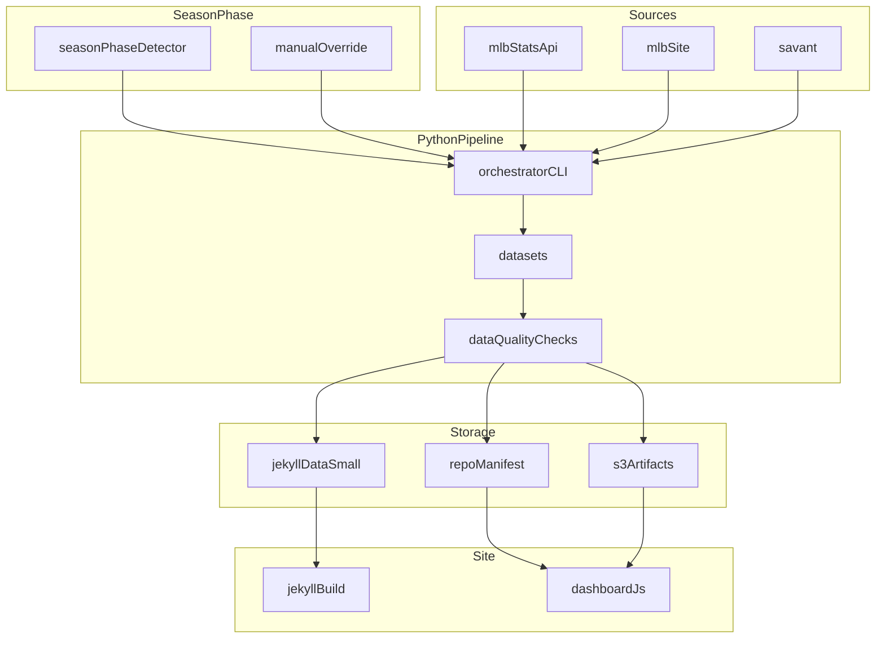

# Modernization plan (backend-first, with season phases)

This doc is the working modernization plan for this repo. It’s designed to be executed slowly, in small slices, while keeping the site working.

## Decisions already made

- Data hosting model: hybrid but consistent
  - Keep S3 for large artifacts
  - Publish a single manifest committed in-repo that every consumer (Jekyll + `assets/js/dashboard.js`) uses to resolve dataset URLs
  - No more hardcoded data URLs in JS
- Baseball Reference policy: no Baseball Reference for new updates
  - Existing historical archives can remain as a baseline initially
  - “Current season append” and ongoing updates move to MLB StatsAPI and Savant
- Postseason section visibility: hide entirely when Dodgers are not in postseason
- Offseason cadence: mostly paused
  - Only run low-frequency jobs (roster/transactions/news) and skip game-derived datasets

## What’s causing the mess today

- Mixed sources: core datasets still scrape Baseball Reference (`pd.read_html`) while other parts already use MLB StatsAPI/Savant
  - Baseball Reference scrapes: `scripts/04_fetch_process_standings.py`, `scripts/05_fetch_process_batting.py`, `scripts/06_fetch_process_pitching.py`, `scripts/13_fetch_process_schedule.py`
  - MLB StatsAPI example: `scripts/00_fetch_league_standings.py` (`statsapi.mlb.com/api/v1/standings`)
  - Savant / gamefeed example: `scripts/20_fetch_game_pitches.py`
- Frontend split-brain:
  - `index.markdown` uses build-time `site.data.*` (Jekyll `_data`)
  - `assets/js/dashboard.js` fetches runtime data from hardcoded S3 website URLs (`https://stilesdata.com/dodgers/data/...`)
- Workflow drift: `.github/workflows/fetch.yml` has many commented-out scripts to reflect season end and special postseason needs

## Target architecture (hybrid but consistent)

## Season phases (so scripts are never commented out)

### Phase values

- `regular_season`
- `postseason`
- `offseason`

### How phase is determined

- Primary: MLB StatsAPI schedule endpoints
  - If LAD has upcoming/active postseason games → `postseason`
  - Else if LAD has upcoming/active regular season games → `regular_season`
  - Else → `offseason`
- Manual override: `workflow_dispatch` input `phase=...` for edge cases

### What runs in each phase (high-level)

- `regular_season`
  - Full refresh: standings, schedule, batting, pitching, Savant-derived datasets, summaries
- `postseason`
  - Postseason datasets enabled (series + player postseason stats)
  - Optional reduced cadence for regular-season datasets (if you want “final season” views to remain stable)
- `offseason` (preferred)
  - Roster + transactions + news
  - Skip game-derived datasets and time series updates

## Implementation milestones (low-risk slices)

### Milestone 0: Inventory and contracts (no behavior changes)

Goal: create a map of “what produces what” and “who consumes what.”

- Inventory datasets consumed by:
  - `index.markdown` (Jekyll `site.data.*`)
  - `assets/js/dashboard.js` (runtime fetches)
- For each dataset, record:
  - producer script
  - source system (MLB StatsAPI, Savant, MLB site scrape, Baseball Reference scrape)
  - storage (S3 path, repo `data/`, Jekyll `_data`)
  - cadence and freshness expectation
  - consumers (which page/component uses it)

### Milestone 1: Add a manifest (no data source changes yet)

Goal: one consistent way to locate datasets.

- Define a repo-committed manifest (location TBD)
  - Fields: `dataset_id`, `season`, `phase`, `url`, `content_type`, `last_updated_iso`, `schema_version`
  - Include a top-level flag like `postseason_active` for homepage behavior
- Publish v2 paths for new outputs under `dodgers/data/v2/...` while keeping existing v1 paths intact

### Milestone 2: Frontend uses the manifest

Goal: eliminate hardcoded URLs and mixed access patterns.

- Update `assets/js/dashboard.js` to:
  - fetch manifest once
  - resolve URLs by `dataset_id`
  - remove hardcoded `https://stilesdata.com/dodgers/data/...` strings
- Normalize Jekyll usage:
  - Keep `_data` only for small, above-the-fold values where build-time rendering is worth it
  - Everything else becomes manifest-driven runtime fetch

### Milestone 3: Season-phase detector + workflow orchestration

Goal: no more commenting scripts in `.github/workflows/fetch.yml`.

- Implement `seasonPhaseDetector` in the pipeline orchestrator
- Replace workflow script lists with one orchestrator command driven by phase
- Adjust cron schedules:
  - frequent during `regular_season`
  - enabled during `postseason`
  - minimal or no-op during `offseason`

### Milestone 4: Postseason hardening

Goal: postseason section “just works” with no year hardcoding.

- Replace year-specific postseason filenames used by the homepage with stable dataset IDs:
  - `postseason_players_current`
  - `postseason_series_current`
- Homepage behavior:
  - hide the entire postseason section unless `postseason_active=true` in the manifest
- Keep year-specific archives if useful, but homepage uses only “current” IDs

### Milestone 5: Replace Baseball Reference for ongoing updates

Goal: no new updates depend on Baseball Reference.

Recommended order:

1. Schedule (small, well-supported by StatsAPI)
2. Current-season standings/game log generation (StatsAPI schedule/boxscore + derived fields)
3. Current-season batting tables (StatsAPI stats endpoints + Savant where needed)
4. Current-season pitching tables (StatsAPI stats endpoints)

Notes:

- Some Baseball Reference-era fields may not exist in MLB APIs (or not historically per-game). Where that happens, prefer:
  - updating charts to use fields we can derive reliably, or
  - publishing a v2 schema that deprecates those fields and keeping v1 stable until consumers migrate

## Guardrails (so we go slowly)

- Change only one of these per PR: a dataset contract, a pipeline orchestration behavior, or a frontend consumer
- Always ship behind versioned paths (`v2`) until the consumer is switched
- Keep the old outputs until the homepage no longer requests them
- Add freshness checks in the pipeline (manifest timestamps + expected dataset IDs)

## Worklist (tracked tasks)

1. Inventory datasets and producers/consumers
2. Define and publish the manifest
3. Implement season-phase detector + phase→datasets mapping
4. Create pipeline package + orchestrator CLI (shared HTTP, S3 IO, logging, schemas)
5. Switch postseason to manifest-resolved “current” datasets and hide when inactive
6. Switch dashboard JS to manifest loader (remove hardcoded URLs)
7. Migrate schedule to MLB StatsAPI (v2)
8. Update GitHub Actions to run orchestrator by phase and validate outputs
