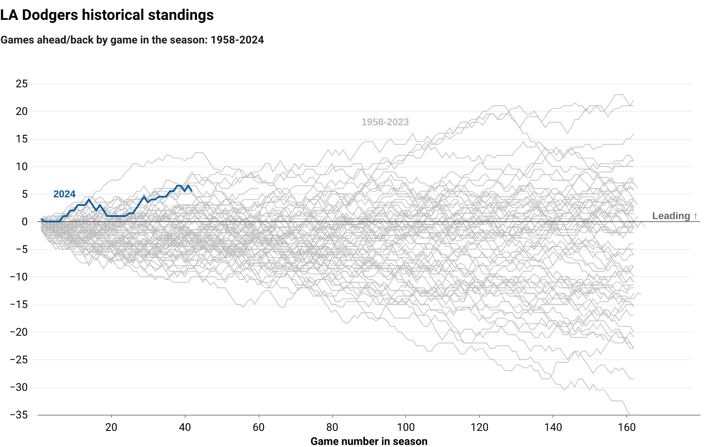

# LA Dodgers standings tracker

This repository — which is a work in progress — maintains an automated workflow to fetch, process and store the LA Dodgers' current standings along with historical game-by-game performance records dating back to 1958. It also contains batting statistics by player and team for the same period.

The data is sourced from the heroes at [Baseball Reference](https://www.baseball-reference.com/teams/LAD/2024-schedule-scores.shtml) and consolidated into a unified dataset for analysis and visualization purposes only. 

## How it works

The repository includes several Python scripts that perform the following daily operations for team standings and batting by season, including:

### Scripts:

- `scripts/01_fetch_process_standings.py`
- `scripts/02_fetch_process_batting.py`
- `scripts/03_viz_standings.py`
- `scripts/04_viz_batting.py`
- `scripts/05_fetch_process_pitching.py`

### What they do:

1. **Fetch current season, batting and pitching data**: Download the current season's game-by-game standings for the LA Dodgers from [Baseball Reference](https://www.baseball-reference.com/teams/LAD/2024-schedule-scores.shtml). The latest season's batting statitics for each player also fetched, as are the latest season's pitching statistics for each pitcher and the team as a whole. 
2. **Process data**: Cleans and formats the fetched standings and batting data for consistency with the historical dataset.
3. **Concatenate with historic data**: Merges the current season's data for batting and standings with pre-existing datasets containing records for the 1958 to 2023 seasons.
4. **Create three basic *standings* visualizations**: Reads the standings archive and produces a multi-series [line chart](/visuals/standings.png) comparing the current season with previous seasons. A horizontal [bar chart](/visuals/runs.png) is also produced showing the number of runs produced in each season to the current point for comparison. The script also creates a [facet barcode chart](/visuals/batting_rates.png) showing the per-bat rates for various categories (hits, homers, etc.) over the years. Both rely on the [Altair visualization library](https://altair-viz.github.io/) to create and save the charts into a `visuals` directory.
5. **Save and export data**: Outputs the combined datasets in CSV, JSON and Parquet formats.
6. **Upload to AWS S3**: Uploads the files to an AWS S3 bucket for use and archiving.

## GitHub Actions workflow

The repository uses GitHub Actions to automate the execution of the scripts each day, ensuring the datasets remains up-to-date throughout the baseball season. The workflow includes the following steps:

1. **Set up Python environment**: Prepares the runtime environment with the necessary Python version and dependencies. 
2. **Checkout repository**: Clones the repository's content to the GitHub Actions runner if changes are necessary (a new game is added). 
3. **Configure AWS credentials**: Securely configures AWS access credentials stored in GitHub Secrets, enabling the script to upload files to the S3 bucket.
4. **Execute script**: Runs the Python scripts to fetch the latest standings, process the data and perform the exports and uploads as configured.

## Configuration and usage

To utilize this repository for your own tracking or analysis on the Dodgers or another team, follow these steps:

1. **Fork the repository**: Create a copy of this repository under your own GitHub account.
2. **Configure secrets**: Add the following secrets to your repository settings for secure AWS S3 uploads (optional):
    - `YOUR_AWS_KEY`: Your AWS Access Key ID.
    - `YOUR_AWS_SECRET`: Your AWS Secret Access Key.
3. **Adjust the scripts (Optional)**: Modify the Python scripts as necessary to fit your specific team, data processing or analysis needs.
4. **Monitor actions**: Check the "Actions" tab in your GitHub repository to see the workflow executions and ensure data is being updated as expected.

## Data storage and access

The processed datasets are available in the `data` directory within this repository and are also uploaded to an AWS S3 bucket.

### Standings

**Game-by-game standings, 1958 to present (10,400+ rows):**

- [JSON](https://stilesdata.com/dodgers/data/standings/dodgers_standings_1958_present.json)
- [CSV](https://stilesdata.com/dodgers/data/standings/dodgers_standings_1958_present.csv)
- [Parquet](https://stilesdata.com/dodgers/data/standings/dodgers_standings_1958_present.parquet)

**Data structure:**
*Each row represents a game in a specific season*

| column_name     | column_type     | column_description                   |
|-----------------|-----------------|--------------------------------------|
| `gm`            | int64           | Game number of season                |
| `game_date`     | datetime64[ns]  | Game date (%Y-%m-%d)                 |
| `home_away`     | object          | Game location ("home" vs. "away")    |
| `opp`           | object          | Three-digit opponent abbreviation    |
| `result`        | object          | Dodgers result ("W" vs. "L")         |
| `r`             | int64           | Dodgers runs scored                  |
| `ra`            | int64           | Runs allowed by Dodgers              |
| `record`        | object          | Dodgers season record after game     |
| `wins`        | int64          | Dodgers wins after game     |
| `losses`        | int64          | Dodgers losses after game     |
| `win_pct`        | float64          | Dodgers season record after game     |
| `rank`          | object          | Rank in division*                    |
| `gb`            | float64         | Games back in division*              |
| `time`          | object          | Game length                          |
| `time_minutes`  | int64           | Game length, in minutes              |
| `day_night`     | object          | Start time: "D" vs. "N"              |
| `attendance`    | int64           | Home team attendance                 |
| `year`          | object          | Season year                          |

\* *Before divisional reorganization in the National League in 1969, these figures represented league standings.*

### Batting

**Season-by-season batting statistics, by player, 1958 to present:**

- [JSON](https://stilesdata.com/dodgers/data/batting/dodgers_player_batting_1958_present.json)
- [CSV](https://stilesdata.com/dodgers/data/batting/dodgers_player_batting_1958_present.csv)
- [Parquet](https://stilesdata.com/dodgers/data/batting/dodgers_player_batting_1958_present.parquet)

**Data structure:**
*Each row represents a player in a specific season*

| column_name | column_type | column_description                                      |
|-------------|-------------|---------------------------------------------------------|
| `rk`        | object      | Rank order at output                                    |
| `pos`       | object      | Position                                                |
| `name`      | object      | Player name                                             |
| `age`       | object      | Player age on June 30                                   |
| `g`         | int64       | Game appearances                                        |
| `pa`        | int64       | Plate appearances*                                      |
| `ab`        | int64       | At-bats*                                                |
| `r`         | int64       | Runs scored                                             |
| `h`         | int64       | Hits                                                    |
| `2b`        | int64       | Doubles                                                 |
| `3b`        | int64       | Triples                                                 |
| `hr`        | int64       | Home runs                                               |
| `rbi`       | int64       | Runs batted in                                          |
| `sb`        | int64       | Stolen bases                                            |
| `cs`        | int64       | Caught stealing                                         |
| `bb`        | int64       | Walks                                                   |
| `so`        | int64       | Strikeouts                                              |
| `ba`        | float64     | Batting average                                         |
| `obp`       | float64     | On-base percentage                                      |
| `slg`       | float64     | Slugging percentage                                     |
| `ops`       | float64     | OPB + SLG                                               |
| `ops_plus`  | float64     | OPS adjusted to player's home park                      |
| `tb`        | int64       | Total bases                                             |
| `gdp`       | int64       | Double plays grounded into                              |
| `hbp`       | int64       | Hit by pitch                                            |
| `sh`        | int64       | Sacrifice hits                                          |
| `sf`        | int64       | Sacrifice flies                                         |
| `ibb`       | int64       | Intentional walks                                       |
| `season`    | object      | Season                                                  |
| `bats`      | object      | Player's batting side (right, left, unknown)            |

\* *An at-bat is when a player reaches base via a fielder's choice, hit or an error — not including catcher's interference — or when a batter is put out on a non-sacrifice. A plate appearance refers to each completed turn batting, regardless of the result.*

**Season-by-season batting at the team level, 1958 to present:**
- How the team ranks or ranked in the league by season
    - [JSON](https://stilesdata.com/dodgers/data/batting/dodgers_team_batting_ranks_1958_present.json)
    - [CSV](https://stilesdata.com/dodgers/data/batting/dodgers_team_batting_ranks_1958_present.csv)
    - [Parquet](https://stilesdata.com/dodgers/data/batting/dodgers_team_batting_ranks_1958_present.parquet)

*Data structure coming soon*

- Team aggregates by season for major batting stats: hits, homers, strikeouts, etc.
    - [JSON](https://stilesdata.com/dodgers/data/batting/dodgers_team_batting_1958_present.json)
    - [CSV](https://stilesdata.com/dodgers/data/batting/dodgers_team_batting_1958_present.csv)
    - [Parquet](https://stilesdata.com/dodgers/data/batting/dodgers_team_batting_1958_present.parquet)

*Data structure coming soon*

### Pitching

**Current season pitching:**
- Team aggregates for major pitching stats: runs, ERA, etc.
    - [JSON](https://stilesdata.com/dodgers/data/pitching/dodgers_pitching_totals_current.json)
    - [CSV](https://stilesdata.com/dodgers/data/pitching/dodgers_pitching_totals_current.csv)
    - [Parquet](https://stilesdata.com/dodgers/data/pitching/dodgers_pitching_totals_current.parquet)

*Data structure coming soon*

- Team's league ranking for major pitching stats: runs, ERA, etc.

    - [JSON](https://stilesdata.com/dodgers/data/pitching/dodgers_pitching_ranks_current.json)
    - [CSV](https://stilesdata.com/dodgers/data/pitching/dodgers_pitching_ranks_current.csv)
    - [Parquet](https://stilesdata.com/dodgers/data/pitching/dodgers_pitching_ranks_current.parquet)

*Data structure coming soon*

---

## Contributions

Contributions, suggestions and enhancements are welcome! Please open an issue or submit a pull request if you have suggestions for improvement.

## License

This project is open-sourced under the MIT License. See the LICENSE file for more details.

